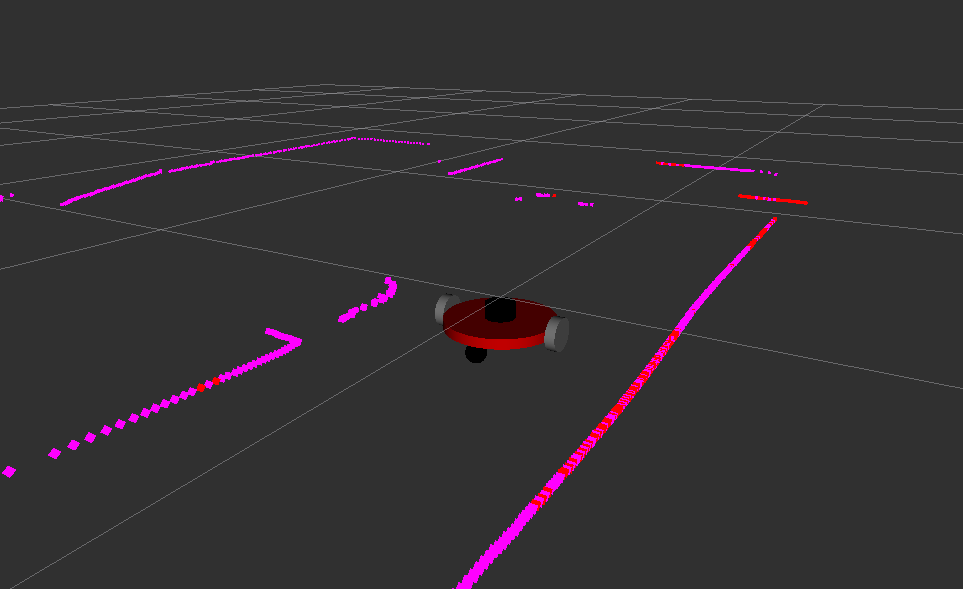
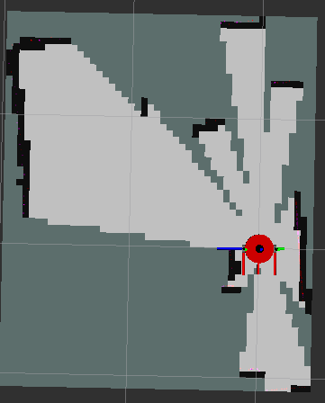
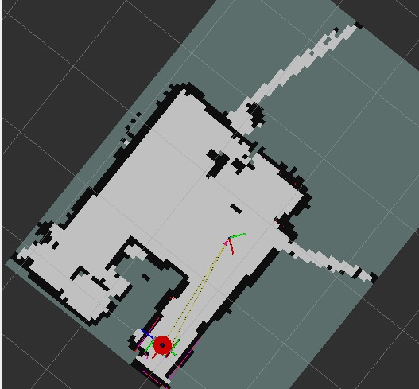

# MyWork_UbuntuRos2

[](#)
[](#)
[](#)
[](#)
[](#)
[](#)
[](#)
[](#)
[](#)
[](#)
[](#)
[](#)


# Robot Móvil con ROS 2, LiDAR A1 y Navegación

## Descripción General del Proyecto

Este repositorio contiene el desarrollo de un robot móvil diferencial con ROS 2 y un LiDAR A1. El paquete principal está dentro de la carpeta:

```
src/robot_nav
```

Capaz de:

* Realizar SLAM para construir un mapa en tiempo real

* Localizarse dentro de un mapa previamente generado

* Integrar un control PID ejecutado en microcontrolador (Raspberry Pi Pico)

* Visualizar todos los datos del sistema en RViz2

El proyecto nace como parte del PAE – Desarrollo de un robot móvil capaz de navegar en entornos dinámicos y constituye la base del Trabajo de Grado (TDG) donde se extenderá a navegación inteligente.

## Objetivos del Proyecto
**Objetivos logrados**

* Implementación completa del stack de ROS 2 para un robot diferencial.

* Integración física del robot: estructura, motores, encoders, LiDAR y Raspberry Pi.

* Publicación de odometría por diseño propio del nodo puente (pico_bridge).

* Visualización del LiDAR A1 en RViz2.

* SLAM funcional utilizando paquetes estándar de ROS 2.

* Localización mediante AMCL configurado acorde a la cinemática del robot.

* Corrección y estabilización del control del robot (PID en Raspberry Pi Pico).

* Estructura de trabajo clara: slam_launch, localization_launch, nav_launch.

**Trabajo futuro**

* Mejorar la navegación en ambientes dinámicos, ajustando parámetros del planner local.

* Implementación de técnicas básicas de IA para ajustar dinámicamente parámetros de navegación.

* Integrar una capa de decisiones basada en fuzzy logic (planeado para el TDG).

* Crear nodos para control avanzado y navegación.


## 🧩 Control base del robot

El movimiento básico del robot no depende de SLAM, localización ni navegación. El control directo se realiza mediante el nodo:

``
pico_bridge.py
``
Este nodo:

* Publica la odometría (/odom)

* Envía comandos de velocidad (/cmd_vel) al microcontrolador

Para ejecutar únicamente esta capa base del sistema:

```md
ros2 launch robot_nav bridge.launch.py
```

### 🕹️ Teleoperación del robot

Una vez ejecutado bridge.launch.py, el robot puede ser controlado manualmente mediante teclado:

```md
ros2 run teleop_twist_keyboard teleop_twist_keyboard \
  --ros-args -p speed:=0.4 -p turn:=2.85
```

Este comando permite validar:

* Respuesta de los motores

* Funcionamiento del PID en el microcontrolador

* Publicación correcta de /cmd_vel y /odom

Este modo permite mover el robot y validar el control sin ejecutar SLAM ni AMCL.
 
## Launch Files Principales (paquete robot_nav)
### 🗺️ 1. SLAM Launch

**Archivo**: slam_launch.py

* Inicializa el nodo del LiDAR.

* Ejecuta SLAM Toolbox.

* Genera el mapa en tiempo real.

Uso:
```md
ros2 launch robot_nav slam.launch.py
```

### 📍 2. Localization Launch

Archivo: localization_launch.py

Carga un mapa previamente generado.

Ejecuta AMCL para localización.

Uso:
```md
ros2 launch robot_nav localization.launch.py
```

### 🧭 3. Navigation Launch (Preparando para TDG)

```md
ros2 launch robot_nav nav.launch.py
```

⚠️ Este launch está documentado y organizado, pero la navegación aún no está correctamente implementada.

Será usado para Nav2 una vez los módulos y parámetros estén definidos.

Está previsto que sea funcional para la fase inicial del TDG.


## 🧪 Resultados y Evidencias

### 🧱 Modelo mecánico y descripción del robot (CAD y URDF)

El diseño del robot se desarrolló inicialmente mediante modelado CAD, el cual sirvió como base para la posterior construcción del modelo URDF/XACRO utilizado en ROS 2.

El URDF permite:

Visualizar correctamente el robot en RViz2

Definir la estructura cinemática

Establecer las transformaciones TF entre enlaces

Integrar sensores como el LiDAR

#### 🧩 Diseño CAD del robot

<p align="center">  </p>

#### 🤖 Modelo URDF visualizado en RViz2

<p align="center">  </p>

### 🗺️ Mapa generado con SLAM

<p align="center">  </p>

### 📍 Localización del robot con AMCL

<p align="center">  </p>


## 📁 Estructura del Repositorio

```md
MyWork_UbuntuRos2/
│
├── build/ 
├── install/ 
├── log/ 
├── map/
├── src/
│ └── robot_nav/
│ ├── launch/
│ ├── config/
│ ├── urdf/
│ ├── rviz/
│ └── scripts/
│
├── images/
├── .gitignore
├── LICENSE
└── README.md
```


## 🔧 Instalación y Uso

### Requisitos

* Ubuntu 22.04 LTS

* ROS 2 Humble Hawksbill

* RPLIDAR A1

### Instalación de dependencias principales

En este proyecto, ROS 2 Humble fue instalado directamente desde los repositorios oficiales mediante apt, sin configuraciones adicionales

```md
sudo apt update
sudo apt install -y ros-humble-desktop
```

Configurar el entorno de ROS 2:

```md
source /opt/ros/humble/setup.bash
```

#### Instalación de dependencias principales

```md
sudo apt install -y \
ros-humble-slam-toolbox \
ros-humble-amcl \
ros-humble-nav2-bringup \
ros-humble-rplidar-ros \
ros-humble-teleop-twist-keyboard \
ros-humble-xacro \
ros-humble-rviz2
```

### 1️⃣ Clonar el repositorio
```md
git clone https://github.com/Rubiores/MyWork_UbuntuRos2.git
```
### 2️⃣ Compilar el workspace
```md
cd ~/MyWork_UbuntuRos2
colcon build
source install/setup.bash
```
### 3️⃣ Ejecutar SLAM o Localización

```md
ros2 launch robot_nav slam_launch.py
ros2 launch robot_nav localization_launch.py
```

## 👤 Autor

**Alejandro Rubio Salas**

Semillero de Investigación SICORA

Universidad Nacional de Colombia – Sede La Paz

## 📌 Licencia

Uso libre para fines académicos y de investigación.

